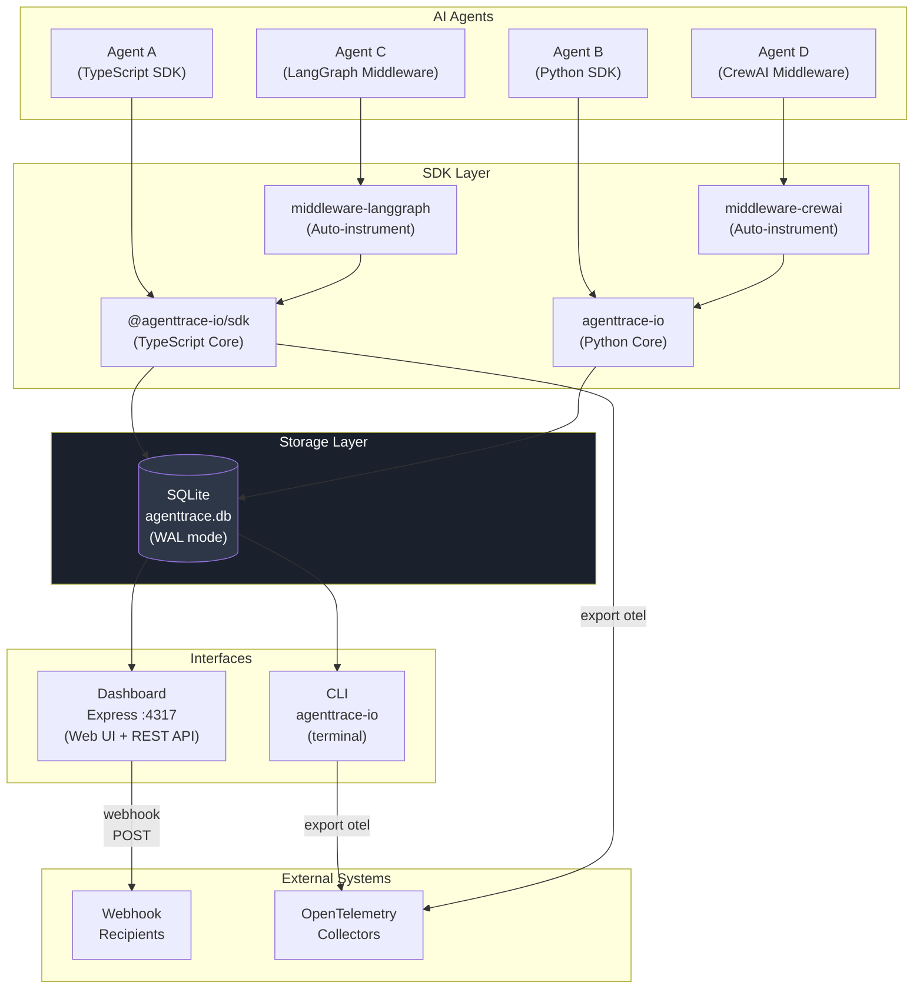
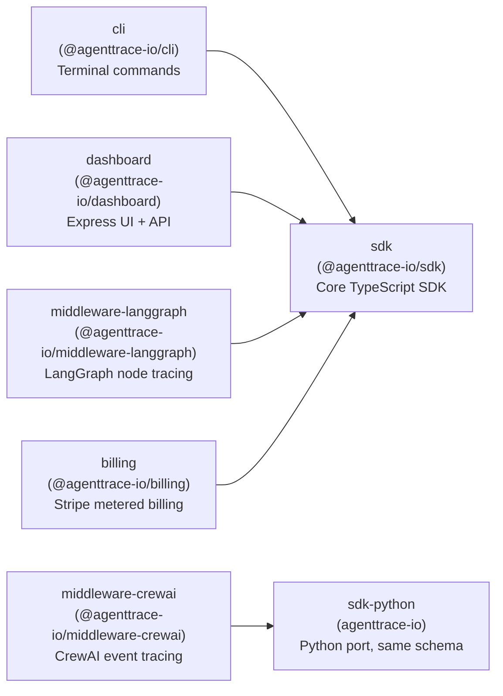
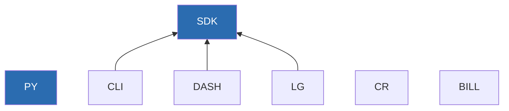
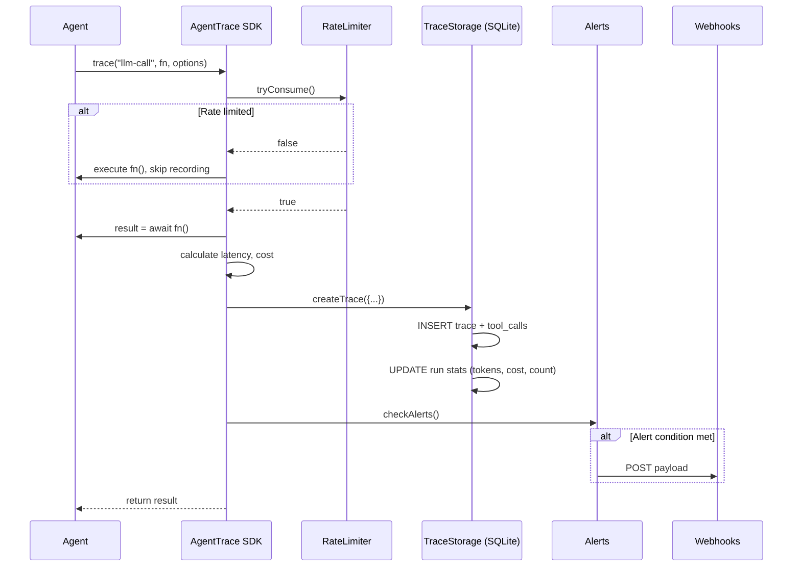
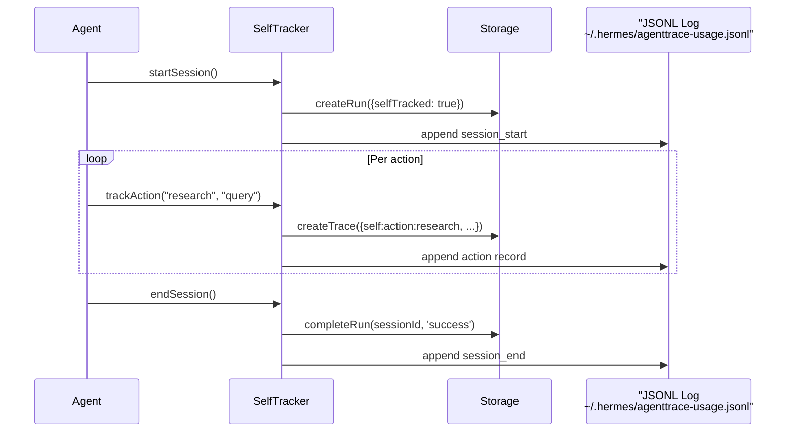
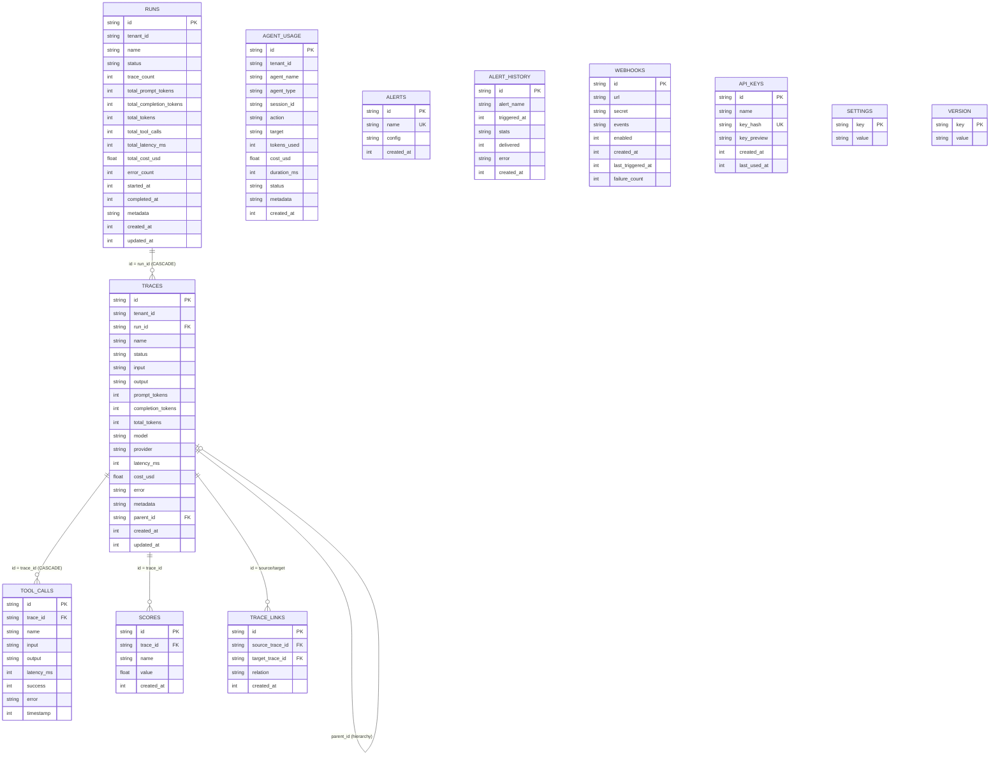
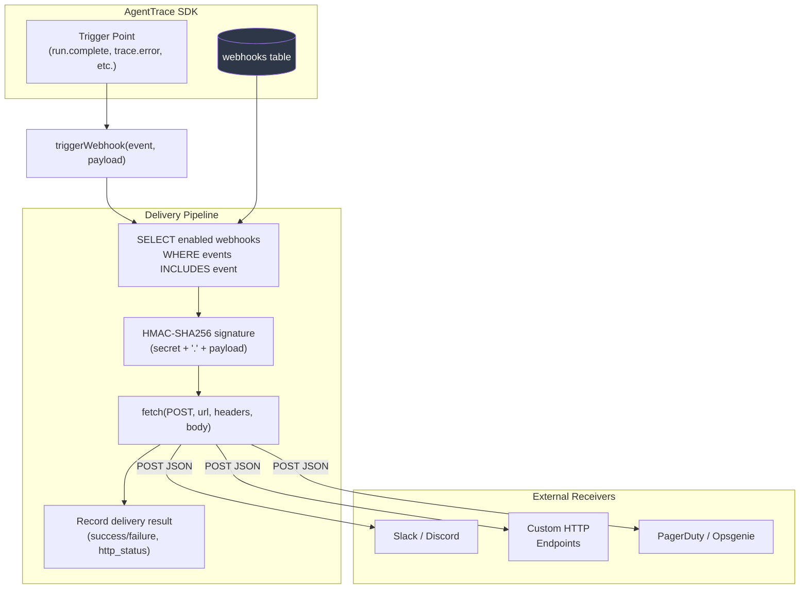
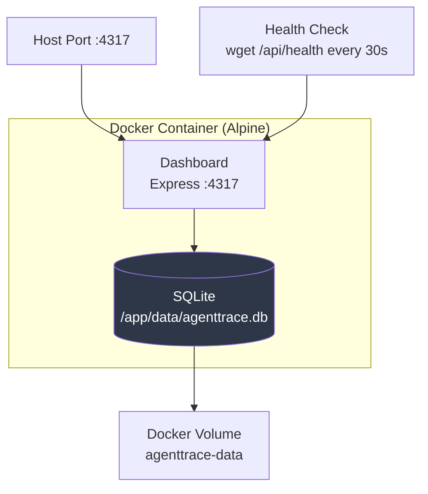
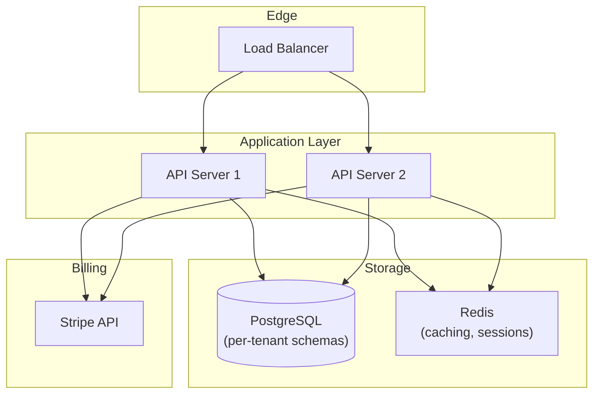
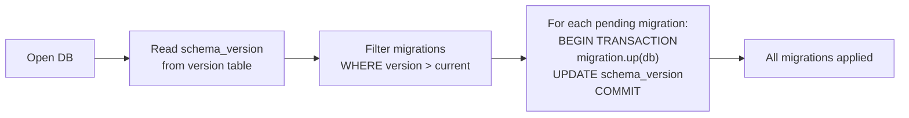

# AgentTrace Architecture

Version 0.1.0 -- Open source AI agent observability, local-first.

---

## Table of Contents

1. [System Overview](#system-overview)
2. [System Diagram](#system-diagram)
3. [Package Architecture](#package-architecture)
4. [Data Flow](#data-flow)
5. [Storage Layer](#storage-layer)
6. [API Design](#api-design)
7. [Multi-Tenant Model](#multi-tenant-model)
8. [Webhook System](#webhook-system)
9. [Deployment Architecture](#deployment-architecture)
10. [Schema Evolution](#schema-evolution)

---

## System Overview

AgentTrace is a local-first observability platform for AI agents. Every trace,
tool call, token usage event, and agent action lives in a single SQLite
database on the user's machine. There is no cloud dependency. Data never
leaves the machine unless the user explicitly exports it or configures a
webhook.

Three interfaces consume the same storage layer:

- **SDK** -- TypeScript and Python libraries that agents import to record traces
- **CLI** -- `agenttrace-io` terminal commands for querying, exporting, and
  launching the dashboard
- **Dashboard** -- Express web UI + REST API served locally on port 4317

---

## System Diagram



---

## Package Architecture

The project is a pnpm monorepo with 7 packages:



Package dependencies (each arrow = depends on):



Key design decisions:

- **SDK is the single source of truth.** All data types, storage logic, cost
  calculators, and alert conditions live in the TypeScript SDK (`packages/sdk`).
- **Python SDK mirrors the schema.** The Python port in `packages/sdk-python`
  uses an identical SQLite schema so both SDKs can read/write the same database.
- **Framework middleware is separate.** LangGraph and CrewAI integrations live
  in their own packages to avoid forcing framework dependencies on core users.

---

## Data Flow

### Tracing an Agent Operation



### Agent Self-Tracking Flow



---

## Storage Layer

### Engine

- **SQLite** via `better-sqlite3` (synchronous, fast, zero-config)
- **WAL journal mode** for concurrent read performance
- **Foreign keys enabled** with CASCADE deletes on parent removal
- Single file: `./agenttrace.db` (configurable via `dbPath` or `AGENTTRACE_DB_PATH` env var)

### Schema (12 tables, schema version 3)



### Indexes

| Table | Index | Columns | Purpose |
|-------|-------|---------|---------|
| traces | idx_traces_run_id | run_id | Run detail lookups |
| traces | idx_traces_status | status | Filter by status |
| traces | idx_traces_created_at | created_at | Time-based queries, cleanup |
| traces | idx_traces_cost | cost_usd | Cost-based filtering |
| traces | idx_traces_parent_id | parent_id | Tree traversal |
| tool_calls | idx_tool_calls_trace_id | trace_id | Trace detail |
| tool_calls | idx_tool_calls_name | name | Top tools query |
| scores | idx_scores_trace_id | trace_id | Score lookup |
| scores | idx_scores_name | name | Score grouping |
| alerts | idx_alerts_name | name | Alert CRUD |
| alert_history | idx_alert_history_alert_name | alert_name | History per alert |
| alert_history | idx_alert_history_triggered_at | triggered_at | Recent history |
| trace_links | idx_trace_links_source | source_trace_id | Link resolution |
| trace_links | idx_trace_links_target | target_trace_id | Link resolution |
| agent_usage | idx_agent_usage_agent_name | agent_name | Agent queries |
| agent_usage | idx_agent_usage_session_id | session_id | Session grouping |
| agent_usage | idx_agent_usage_action | action | Action type queries |
| agent_usage | idx_agent_usage_status | status | Status filtering |
| agent_usage | idx_agent_usage_created_at | created_at | Time-based queries |
| webhooks | idx_webhooks_enabled | enabled | Active webhook filter |
| api_keys | idx_api_keys_created_at | created_at | Key listing |

### Data Retention

Two mechanisms control storage growth:

1. **Max traces cap** (`config.maxTraces`, default 10000). After each trace,
   oldest records are deleted if the cap is exceeded.
2. **Retention days** (`config.retentionDays`, default 30). A scheduled
   interval removes all traces, runs, and agent usage older than N days.

Both are configurable at SDK init time or via `agenttrace-io retention set`.

---

## API Design

### SDK Interface (TypeScript)

The `AgentTrace` class is the primary entry point:

```
AgentTrace
  constructor(config?: TraceConfig)

  // Run lifecycle
  startRun(name, metadata?): string          // returns runId
  completeRun(status?): void

  // Core tracing
  trace<T>(name, fn, options?): Promise<T>

  // Querying
  getTraces(filter?): Trace[]
  getTrace(id): Trace | null
  getRuns(limit?): Run[]
  getRun(id): Run | null
  getStats(): TraceStats
  getCostBreakdown(filter?): CostBreakdown

  // Agent usage
  recordAgentUsage(record): void
  getAgentUsage(filter?): AgentUsageRecord[]
  getUsageStats(agentName?, from?, to?): UsageStats
  getActiveAgents(): AgentWho[]
  getAgentWho(filter?): AgentWho[]
  getAgentSessions(filter?): AgentSession[]

  // Multi-agent
  getTraceTree(traceId): TraceTreeNode
  linkTraces(traceIds): void

  // Scoring / evaluation
  evaluate(options): Promise<ScorerResult[]>

  // Alerts
  registerAlert(condition): void
  getAlertHistory(): AlertHistory[]

  // Webhooks
  addWebhook(url, events, secret?): string
  getWebhooks(): WebhookConfig[]
  removeWebhook(id): void
  triggerWebhook(event, payload): Promise<WebhookDelivery[]>

  // API keys
  createApiKey(name): CreatedApiKey
  listApiKeys(): ApiKey[]
  revokeApiKey(id): void
  validateApiKey(key): {valid, permissions}

  // Export
  export(format): string                    // json | csv | otel

  // Lifecycle
  onUsage(listener): void
  offUsage(listener): void
  close(): void
```

### REST API (Dashboard)

Base URL: `http://localhost:4317`

| Method | Path | Auth | Description |
|--------|------|------|-------------|
| GET | `/api/health` | No | Health check (DB, disk, memory) |
| GET | `/api/stats` | Yes | Summary statistics |
| GET | `/api/costs` | Yes | Cost breakdown by model/day |
| GET | `/api/runs` | Yes | List runs |
| GET | `/api/runs/:id` | Yes | Run detail |
| GET | `/api/traces` | Yes | List traces (filterable) |
| GET | `/api/traces/:id` | Yes | Trace detail |
| GET | `/api/traces/:id/tree` | Yes | Trace tree (multi-agent) |
| GET | `/api/export` | Yes | Download export (json/csv) |
| GET | `/api/usage` | Yes | Agent usage records |
| GET | `/api/usage/stats` | Yes | Aggregated usage stats |
| GET | `/api/usage/active` | Yes | Active agents list |
| GET | `/api/usage/stream` | Yes | SSE stream of usage events |
| GET/POST/DELETE | `/api/v1/keys` | Yes | API key management |

Authentication: `X-API-Key` header. The dashboard ships with an in-memory key
store by default. The first key can be created via `POST /api/v1/keys`.

### CLI Interface

```
agenttrace-io <command> [options]

Commands:
  init          Create empty agenttrace.db
  dashboard     Start local dashboard server at http://localhost:4317
  runs          List recent runs
  traces        List traces
  stats         Show summary statistics
  costs         Show cost breakdown (--daily for per-day)
  export        Export traces (json/csv/otel)
  tree          Show trace tree for multi-agent visualization
  alerts        Manage alerts (list/test/history)
  health        Check system health (DB, disk, memory)
  who           Show active agents
  cost          Show agent cost breakdown
  sessions      List agent sessions with aggregates
  activity      Show recent agent activity timeline
  self-stats    Show self-tracked (OWL/Hermes) usage
  cleanup       Manually run data retention cleanup
  retention     Show or set retention policy
  benchmark     Run performance benchmarks
  version       Show CLI version
```

---

## Multi-Tenant Model

AgentTrace uses a **soft-tenant** model. There are no separate databases or
schema namespaces. Tenant scoping is achieved through `tenant_id` columns on
the core tables.

### Tenant Isolation

```sql
-- Every tenant-scoped query appends:
WHERE tenant_id = ?
```

Tables with `tenant_id`:

- `runs` -- tenant_id set at startRun()
- `traces` -- tenant_id inherited from SDK config
- `agent_usage` -- tenant_id set per record

### Configuration

```typescript
// Each AgentTrace instance is scoped to one tenant
const agent = new AgentTrace({
  tenantId: 'team-alpha'
});

// SDK methods automatically filter by tenantId internally
```

### Projects (Schema v3)

The `projects` table stores named projects with API keys for dashboard access:

```sql
CREATE TABLE projects (
  id TEXT PRIMARY KEY,
  name TEXT NOT NULL,
  api_key TEXT NOT NULL UNIQUE,
  created_at INTEGER NOT NULL
);
```

Projects provide a lightweight namespace for dashboard authentication. API key
management uses SHA-256 hashing -- the full key is shown once at creation, only
the hash is persisted.

### Isolation Guarantees

This is **soft multi-tenancy**, not hard isolation:

- All tenants share one SQLite file and one process
- Tenant filtering is application-level (SQL WHERE clauses)
- No row-level security SQLite features are used
- Designed for single-team or single-user scenarios, not hostile multi-tenancy

For production hosted deployments (v1.0 roadmap), the architecture supports
migrating to per-tenant database files or schema-based isolation.

---

## Webhook System

### Architecture



### Event Types

| Event | When Triggered |
|-------|---------------|
| `trace.complete` | After every successful trace |
| `trace.error` | After every trace with error status |
| `run.complete` | When `completeRun()` is called with success |
| `run.error` | When `completeRun()` is called with failure/error |
| `cost.threshold` | When cost exceeds a registered alert condition |
| `agent.inactive` | When an agent has no activity within a threshold |

### Webhook Payload

```json
{
  "event": "trace.error",
  "timestamp": 1717200000000,
  "traceId": "abc-123",
  "runId": "def-456",
  "error": "Rate limit exceeded",
  "stats": {
    "totalTraces": 150,
    "successRate": 0.87
  }
}
```

### Signature Verification

When a webhook has a secret configured, each delivery includes:

```
X-AgentTrace-Signature: sha256=<hex>
```

Where the hex digest is `HMAC-SHA256(secret, "." + JSON.stringify(payload))`.
Receivers should verify this signature before processing.

### Failure Handling

- Each webhook has a `failure_count` column that increments on failed delivery
- Failed deliveries are logged but do not throw (alerts must never crash the
  host process)
- The `last_triggered_at` column tracks the most recent delivery attempt
- Webhooks can be disabled (`enabled = 0`) via `removeWebhook()`

### Configuration

```typescript
// Programmatic registration
const webhookId = agent.addWebhook(
  'https://hooks.slack.com/services/...',
  ['trace.error', 'run.error', 'cost.threshold'],
  'my-signing-secret'
);

// Via CLI
// agenttrace-io alerts list
// agenttrace-io alerts test --name high-error-rate
// agenttrace-io alerts history
```

---

## Deployment Architecture

### Local Development

```
Developer Machine
  Agent --> SDK --> ./agenttrace.db
  CLI   --> SDK --> ./agenttrace.db
  Dashboard Express :4317 --> SDK --> ./agenttrace.db
```

All three interfaces share the same SQLite file on the local filesystem.

### Docker Deployment



- Multi-stage Alpine Dockerfile (builder + runner)
- Persistent volume at `/app/data` for the SQLite database
- Built-in health check hitting `/api/health`
- Single process: `node packages/cli/dist/index.js dashboard --host 0.0.0.0`
- Port: 4317 (OTLP-adjacent, chosen for convention)

### v1.0 Hosted Deployment (Planned)



The v1.0 hosted version will migrate from SQLite to PostgreSQL with
per-tenant schemas, add Redis for session caching, and integrate Stripe for
metered billing (the `billing` package is already implemented).

---

## Schema Evolution

Schema migrations are tracked via the `version` table (`key = 'schema_version'`).
The `migrations.ts` module provides a sequential migration runner.

### Migration History

| Version | Name | Changes |
|---------|------|---------|
| 1 | initial | Base schema: runs, traces, tool_calls, scores, alerts, alert_history, trace_links, agent_usage, webhooks, api_keys, settings, version |
| 2 | multi-agent | Added `parent_id` to traces, `trace_links` table for cross-agent linking |
| 3 | multi-tenant | Added `projects` table, `tenant_id` column to runs/traces/agent_usage |

### Migration Strategy



- Migrations run inside transactions (all-or-nothing)
- Both `meta` and `legacy version` tables are kept in sync for Python SDK
  compatibility
- The `TraceStorage` constructor also handles additive migrations (ALTER TABLE
  ADD COLUMN) for columns that may already exist from partial migrations

### Python SDK Compatibility

The Python SDK (`packages/sdk-python`) uses the same schema version numbers and
table structures. Both SDKs can read and write the same SQLite database file
without conflicts.
